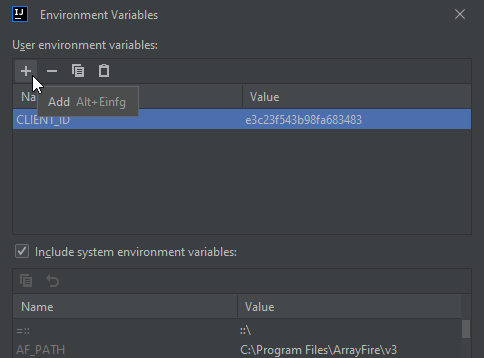

CLIENT_ID : b2e658b02dec2c57a844

CLIENT_SECRET : b774716197efd80af0324c27a9ac9b1429fe039a

First Start:

Step 1: Open Idea and then for developing the program itself. In IntelliJ, you can easily set the environment variables through the Run Configuration.

Step 2: Start Docker using docker-compose.yml

Step 3: Start SplitterAppliaction