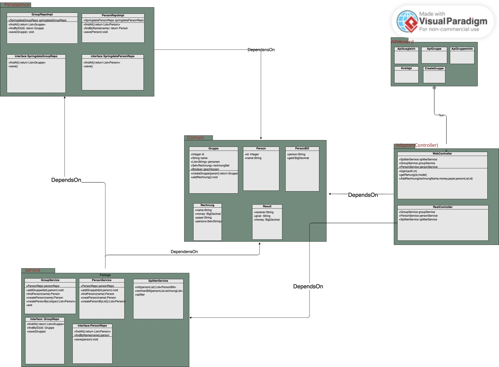

== 1 Introduction and goals

== 1.1Requirements Overview
1. Develop a software that facilitates transparent cost breakdown and account balancing.

2.  Allow users to only transfer money to another person or receive money transferred from another person, but not both.

3.  Allow up to one transfer between two people, without allowing anyone to transfer money to themselves.

4.  Optimize the number of transactions required to achieve the desired result, in order to minimize the overall transactional burden.

== 1.2 Stakeholder

Positive : Young people who often go out and travel with friends

Negative: Do not like to socialise and prefer to go out alone

== 2 Restrictions
1. The application will be implemented as a web application with Spring Boot

2. Port 9000

3.  PostgreSQL is used as a database. The database must be run in a Docker container.

4. We use GitHub as the OAuth provider.

5. The Onion architecture is specified as an architectural pattern.

6. At the domain level, the Tactical DDD pattern must be used.

7. You can use the Gradle submodule.

8. Use ArchUnit to automatically check.

== 3 Context and Scope
== 3.1 Business context(The Diagram Not finished)

== 3.2 Technical context
 Domain

Gruppe: save group id, group name, member list, all billing records

Person: Save the name of the person,and all the groups he joined

PersonBill: just an intermediate calculation process

Rechnung; saved RechnungName, Money, Payer, member list

Result: the final result of the bill for each group

 Service

GroupService: Contains all logical relationships about Group; (increase, find..)

PersonService: Contains all logical relationships about Person (increase, find..)

SplitterService: only calculate the distribution results

 Web

ApiRecord: All ApiRecords in it are in the json format that conforms to the test

Restcontroller : for the provided Api test

Webcontroller: front-end and back-end interaction

 Persistenz

not yet implemented

 Configration

apiconfig: configure api

WebSecurityConfiguration: configuration of security (including oauth and csrf)

 Html

Homepage.html: The main page, which displays all the groups of the individual, and can create groups, and can jump to the detailed page of each group at the same time.

CreateGruppe.html: Create a group interface Enter the group name and group members to create

RechnungsDetails: Display the bills of each group, and can add new bills at the same time

Result.html: Displays the final bill calculation results for the current group

Schliessen.html: used to close the current group

Error.html: Illegal operation
